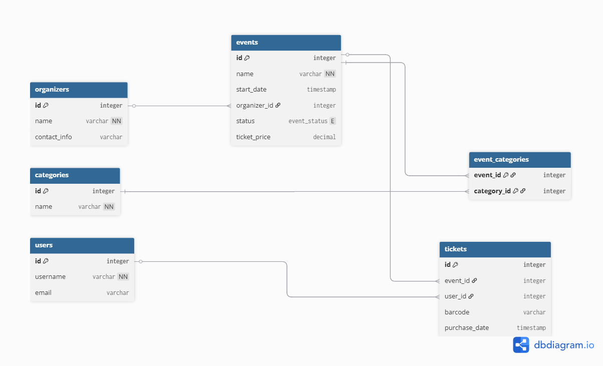

# Event Management System 
## Романчук Георгий 450501
📊 [Sonar](https://sonarcloud.io/summary/overall?id=georgiyr101_EventSystem&branch=main)

## 📋 О проекте
Система управления мероприятиями - REST API сервис для создания и управления мероприятиями, участниками, местами проведения и регистрациями.

## Требования к реализации проекта

1. **Создать Spring Boot приложение.**
2. **Реализовать REST API** для одной ключевой сущности своей предметной области (domain).
3. **Реализовать эндпоинты:**
   - GET endpoint с использованием `@RequestParam`
   - GET endpoint с использованием `@PathVariable`
4. **Реализовать архитектурные слои:** Controller → Service → Repository.
5. **Реализовать DTO и mapper** между Entity и API-ответом.
6. **Настроить Checkstyle** и привести весь код к соответствующему стилю.
7. **Подключить реляционную БД** к проекту.
8. **В модели данных реализовать минимум 5 сущностей:**
   - минимум одну связь OneToMany
   - минимум одну связь ManyToMany
9. **Реализовать CRUD операции.**
10. **Настроить и обосновать использование CascadeType и FetchType.**
11. **Продемонстрировать проблему N+1 и решить её через @EntityGraph или fetch join.**
12. **Реализовать метод, сохраняющий несколько связанных сущностей. Продемонстрировать частичное сохранение данных без @Transactional и полное откатывание операции с @Transactional при возникновении ошибки.**
13. **Нарисовать ER-диаграмму с указанием PK/FK и связей.**
14. **Реализовать сложный GET-запрос с фильтрацией по вложенной сущности с использованием `@Query` (JPQL).**
15. **Реализовать аналогичный запрос через native query.**
16. **Добавить пагинацию (Pageable)** для GET-эндпоинтов, возвращающих списки сущностей.
17. **Реализовать in-memory индекс на основе `HashMap<K, V>`** для ранее запрошенных данных:
    - Ключ должен формироваться из параметров запроса (составной ключ)
    - Обеспечить корректную работу индекса за счёт правильной реализации `equals()` и `hashCode()`
18. **Реализовать инвалидацию индекса** при изменении данных (операции CREATE, UPDATE, DELETE).
19. **Реализовать глобальную обработку ошибок через `@ControllerAdvice`.**
20. **Добавить валидацию входных данных через `@Valid`** с использованием аннотаций Bean Validation.
21. **Реализовать единый формат ошибки** для всех endpoint (поле: timestamp, status, error, message, path).
22. **Настроить логирование через logback:**
    - Уровни логирования (DEBUG, INFO, WARN, ERROR)
    - Ротация логов (по размеру или времени)
23. **Реализовать аспект (AOP)** для логирования времени выполнения сервисных методов.
24. **Подключить Swagger/OpenAPI** с полным описанием всех endpoint и DTO.
25. **Реализовать bulk-операцию (POST со списком объектов)**, имеющую бизнес-смысл в рамках проекта.
26. **Использовать Stream API и Optional** в сервисном слое.
27. **Обеспечить транзакционность bulk-операции.** Продемонстрировать:
    - Работу **без** `@Transactional` (частичное сохранение при ошибке)
    - Работу **с** `@Transactional` (полный откат при ошибке)
    - Показать разницу в состоянии БД
28. **Написать unit-тесты для сервисов** с использованием Mockito.

## API Эндпоинты

| Метод | URL | Описание |
| :--- | :--- | :--- |
| GET | `/api/v1/events/{id}` | Получить мероприятие по его ID |
| GET | `/api/v1/events` | Получить все мероприятия (без фильтра по `status`) |
| GET | `/api/v1/events?status={name}` | Получить мероприятия с фильтром по конкретному статусу |
| POST | `/api/v1/events` | Создать новое мероприятие |
| PATCH | `/api/v1/events/{id}/status?newStatus={name}` | Изменить статус мероприятия |

